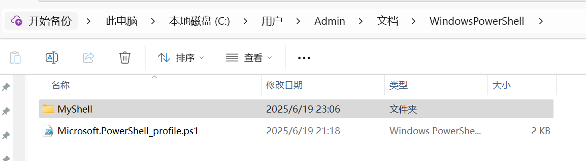

## 说明

这是 私人的 shell 脚本仓库，里面包含了一些常用的 shell 脚本。
分为 mac 和 windows 两个目录，分别存放 mac 和 windows 下的脚本。

## 如何使用

### mac

1. 克隆仓库到 home 目录:
   - 在终端中执行 'cd ~'
2. 在 .zshrc 中添加以下内容
   ```shell
   for func_file in ~/MyShell/mac/*.zsh; do
      source "$func_file"
   done
   ```
3. 在终端中运行, 使配置生效 ( 此命令用于 reload 脚本)
   ```shell
   source ~/.zshrc
   ```
4. 终端运行, 查看相关指令
   ```shell
   hsh
   ```

### windows

1. 找到这个目录 C:\Users\Admin\Documents\WindowsPowerShell
2. 把 MyShell 放在这里目录下
   

3. 在 Microsoft.PowerShell_profile.ps1 中添加以下内容

   ```shell
   $functionsDir = "$PSScriptRoot\MyShell\windows"
   if (Test-Path $functionsDir) {
      Get-ChildItem "$functionsDir\*.ps1" | ForEach-Object {
         . $_.FullName  # 点号表示在当前作用域执行脚本
      }
   }
   ```

4. 终端运行命令, 使配置生效 ( 此命令用于 reload 脚本)

   ```shell
   . $PROFILE
   ```

5. 终端运行, 查看相关指令
   ```shell
   hsh
   ```
