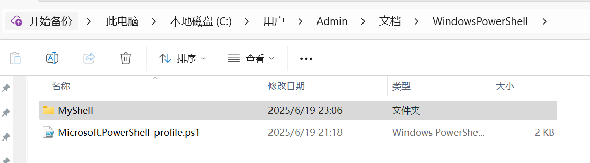
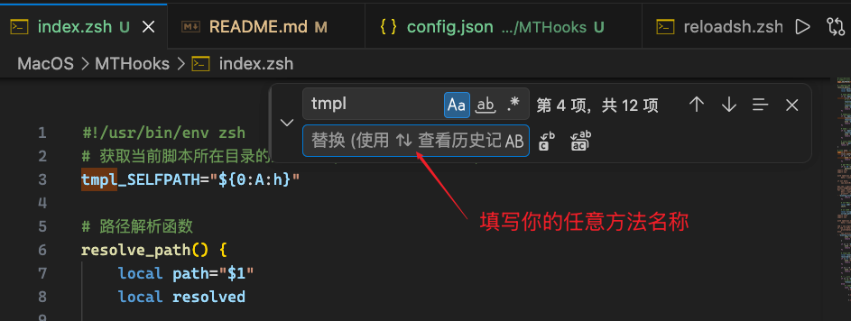

## 说明

这是 私人的 shell 脚本仓库，里面包含了一些常用的 shell 脚本。
分为 mac 和 windows 两个目录，分别存放 mac 和 windows 下的脚本。

## 如何使用

### mac

1. 克隆仓库到 home 目录:
   - 在终端中执行 'cd ~'
2. 在 .zshrc 中添加以下内容
   ```shell
   for func_file in ~/MyShell/MacOS/*.zsh; do
      source "$func_file"
   done
   ```
3. 在终端中运行, 使配置生效 ( 此命令用于 reload 脚本)
   ```shell
   source ~/.zshrc
   ```
4. 终端运行, 查看相关指令
   ```shell
   hsh
   ```

### windows

1.  找到这个目录 C:\Users\Admin\Documents\WindowsPowerShell
2.  把 MyShell 放在这里目录下
    

3.  在 Microsoft.PowerShell_profile.ps1 中添加以下内容

```shell

C:\Users\{用户名}\Documents\WindowsPowerShell\Microsoft.PowerShell_profile.ps1

$functionsDir = "$PSScriptRoot\MyShell\windows"
if (Test-Path $functionsDir) {
   Get-ChildItem -Path $functionsDir -Recurse -Filter \*.ps1 -File | ForEach-Object {
   . $\_.FullName
   }
}

```

4.  终端运行命令, 使配置生效 ( 此命令用于 reload 脚本)

```shell
. $PROFILE
```

5.  终端运行, 查看相关指令

```shell
hsh
```

### 关于 tmpl

tmpl 这是一个模板文件夹(有 mac 和 windows 两种), 内置一个入口文件 index.zhs/index.ps1,
一个配置文件 config.json.

使用时请复制整个文件夹, 在 index.zhs/ index.ps1 中, 找到所有 tmpl, 修改成你想要执行的方法名称就可以使用.

